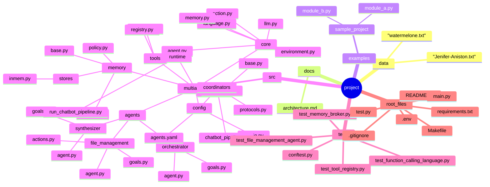

# Multi-Agent System Overview

This document consolidates the system architecture, project structure, and current assessment of the multi-agent GAME (Goals–Actions–Memory–Environment) implementation.

## Core Architecture

Every agent follows the GAME loop:

1. **Goals** define what the agent must accomplish.
2. **Actions** expose tools via the global registry.
3. **Memory** stores interaction history.
4. **Environment** executes selected actions and returns results.

During a run the agent constructs a prompt from goals, available actions, and memory, asks the LLM for the next step, executes the chosen action, updates memory, and repeats until a termination condition is triggered.

### Primary Agent Roles

- **Orchestrator**: analyzes user intent, splits work, routes tasks.
- **Retrieval Worker**: fetches data from files, APIs, or databases and normalizes results.
- **Synthesizer**: deduplicates, clusters, and summarizes information into final reports.
- **File Management Agent**: demonstrates the framework through project file operations and documentation support.

### Communication Flow

```
User Query
    ↓
Orchestrator (analysis & routing)
    ↓
Retrieval Worker(s) (data gathering)
    ↓
Synthesizer (consolidation)
    ↓
Final Response
```

## Repository Structure



## Strengths

- **GAME Loop Compliance**: goals, tool registry, memory, and environment are implemented cleanly inside `Agent.run()`.
- **Clear Separation**: `src/multiagent/` splits core framework, agents, tools, and orchestration concerns.
- **Extensibility**: decorators for tooling, factory functions for agents, and abstract orchestrators make it easy to add capabilities.
- **Memory Building Blocks**: `MemoryBroker`, `MemoryStore`, and retention policies are already scaffolded.

## Gaps to Address

1. **Per-Agent Memory Persistence Missing**  
   Agents allocate fresh `Memory()` instances per run, so history is lost.

2. **MemoryBroker Unused**  
   Shared memory infrastructure exists but no agent or orchestrator writes to or reads from it.

3. **Shared Context Absent in Prompts**  
   Agents only see their own memory, leading to duplicated work and missed context.

4. **Agent Identity Not Enforced**  
   The framework relies on names; a stable `agent_id` is required for reliable memory tracking.

5. **MemoryStore Detached**  
   Interfaces and in-memory implementations exist but are not wired into agents or orchestrators.

6. **Orchestrator Memory Isolation**  
   Orchestrators maintain their own memory but do not surface it through the broker.

7. **Retention Policies Idle**  
   Memory growth is unbounded because no policy is applied during updates.

## Recommended Enhancements

### Immediate

- Add `agent_id` to `Agent` and ensure MemoryBroker operations use it.
- Inject a shared `MemoryBroker` into agents and include shared entries when constructing prompts.
- Automatically publish important results to the broker after each action.

### Short Term

- Connect a `MemoryStore` implementation to load and persist `agent_memory` between runs.
- Apply retention policies (e.g., `RecentRetentionPolicy`) before writing back to memory.

### Medium Term

- Share a single broker instance across orchestrators and agents so coordination state is visible.
- Extend the environment to log which agent produced each shared memory entry for traceability.

### Long Term

- Layer semantic retrieval on top of stored memories.
- Introduce adaptive retention strategies driven by memory content or usage.

## Roadmap

1. Wire the existing MemoryBroker and MemoryStore into the agent lifecycle.
2. Establish stable agent identities and propagate them through orchestrators.
3. Persist per-agent memory and enforce retention to manage prompt size.
4. Build advanced collaboration features (semantic search, richer coordination protocols).

---

With these integrations, the project moves from a solid single-agent implementation to a fully collaborative multi-agent system while keeping the underlying GAME abstractions intact.
